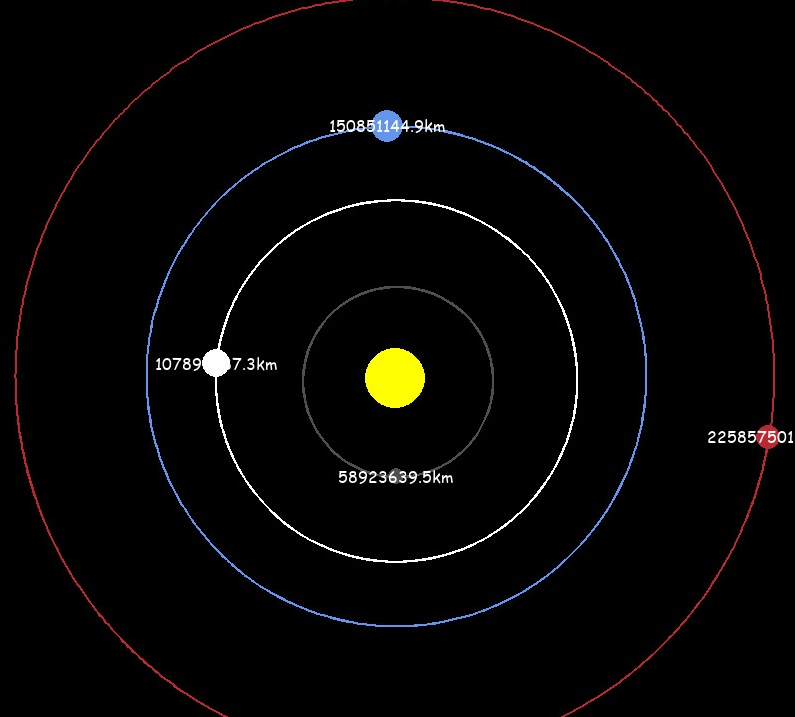

 ˚　　　　✦　🪐　　.　　. 　 ˚　.　　　　 🌀　 . ✦　　　 　˚　　✦　　　.　　. 　 ˚　.　　　　 　　 　🌀　　　 ✦　　.　
 
.                                              # Planet Simluation

　🚀　　.   　　˚　　 　　*　　 　　✦　　　.　　.　　　✦　˚ 　☄️ 　　　 ˚🌒　.˚　　　　✦　　　.　　. 　 ˚　.　　　　 　　

 

# About the Project 👇🏼

This Project is a aplication Python represent my love of Physics!

## Technologies used 🌐

⇨ Python

  
# Autor ✏️

Ingrid Vasconcelos
